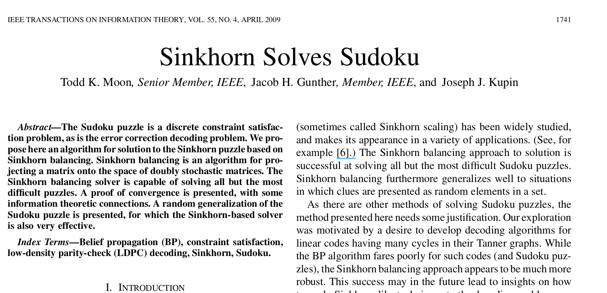

# Sinkhorn-Solves-Sudokuk
### Unofficial [LeetArxiv](https://leetarxiv.substack.com/p/sinkhorn-solves-sudoku) implementation of the paper 'Sinkhorn Solves Sudoku' in C with Python starter code



### Paper Summary
The paper _Sinkhorn Solves Sudoku_ demonstrates an optimal-transport approach to solving Sudoku grids using the [Sinkhorn-knopp](https://leetarxiv.substack.com/p/sinkhorn-knopp-algorithm-24d) algorithm.

We are able to reproduce the authors' primary claim: Sinkhorn balancing with judiciously placed constraints is a foundational reasoning technique.

The code walkthrough is available on [LeetArxiv at this link](https://leetarxiv.substack.com/p/sinkhorn-solves-sudoku).

### Getting Started
Note: We use the `sapientinc/sudoku-extreme` dataset from huggingface.

We provide Python code to load the dataset in `SinkhornSolvesSudoku.ipynb`.

The C code implementation is in the file `ParseCSV.c`. We walk you through the code here: [https://leetarxiv.substack.com/p/sinkhorn-solves-sudoku](https://leetarxiv.substack.com/p/sinkhorn-solves-sudoku)

To run the file, ensure the dataset is available in a folder called `sudoku-data`. Then
```
clear && gcc ParseCSV.c -lm -o m.o && ./m.o
```
